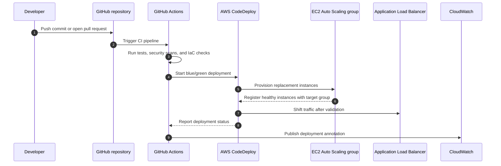
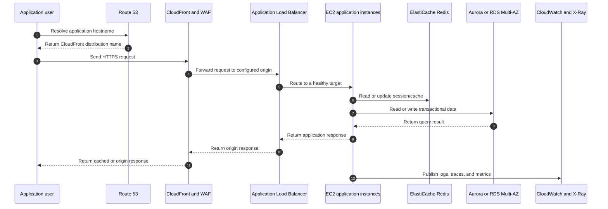

# AWS EC2 HA - Runtime + Deployment Sequence

## Deployment flow

```mermaid
sequenceDiagram
    autonumber
    participant Dev as Developer
    participant GH as GitHub repository
    participant GHA as GitHub Actions
    participant CD as AWS CodeDeploy
    participant ASG as EC2 Auto Scaling group
    participant ALB as Application Load Balancer
    participant CW as CloudWatch

    Dev->>GH: Push commit or open pull request
    GH->>GHA: Trigger CI pipeline
    GHA->>GHA: Run tests, security scans, and IaC checks
    GHA->>CD: Start blue/green deployment
    CD->>ASG: Provision replacement instances
    ASG-->>CD: Register healthy instances with target group
    CD->>ALB: Shift traffic after validation
    CD-->>GHA: Report deployment status
    GHA->>CW: Publish deployment annotation
```

## Request flow

```mermaid
sequenceDiagram
    autonumber
    participant User as Application user
    participant R53 as Route 53
    participant CF as CloudFront and WAF
    participant ALB as Application Load Balancer
    participant EC2 as EC2 application instances
    participant Redis as ElastiCache Redis
    participant DB as Aurora or RDS Multi-AZ
    participant CW as CloudWatch and X-Ray

    User->>R53: Resolve application hostname
    R53-->>User: Return CloudFront distribution name
    User->>CF: Send HTTPS request
    CF->>ALB: Forward request to configured origin
    ALB->>EC2: Route to a healthy target
    EC2->>Redis: Read or update session/cache
    EC2->>DB: Read or write transactional data
    DB-->>EC2: Return query result
    EC2-->>ALB: Return application response
    ALB-->>CF: Return origin response
    CF-->>User: Return cached or origin response
    EC2->>CW: Publish logs, traces, and metrics
```
